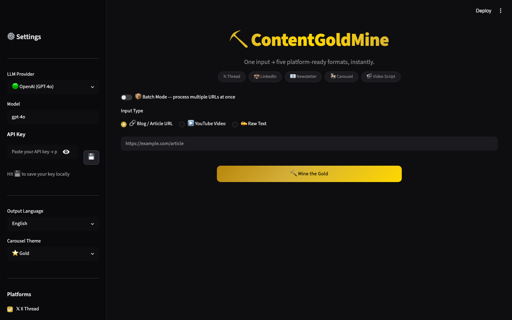
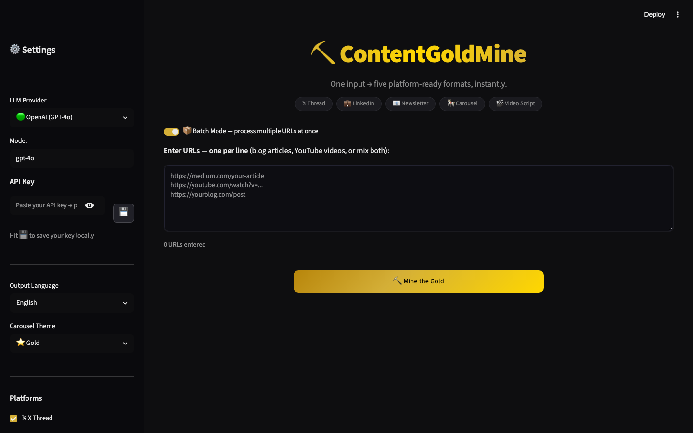
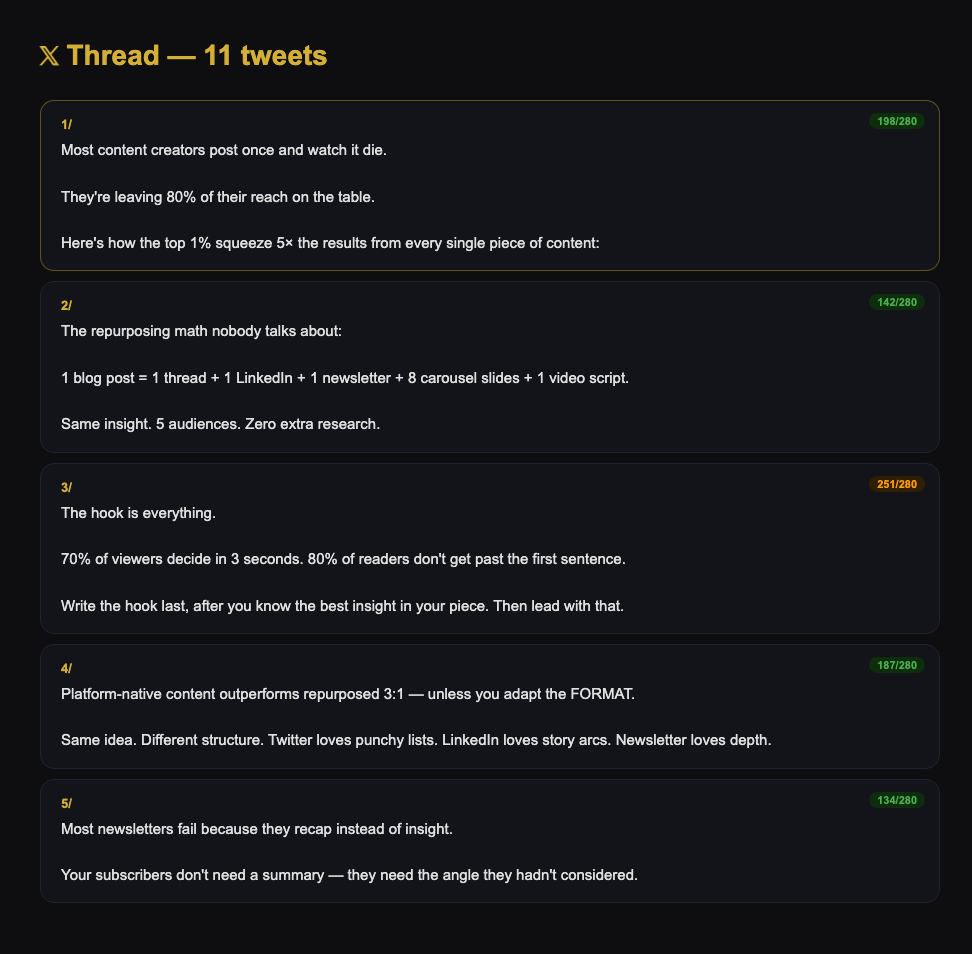
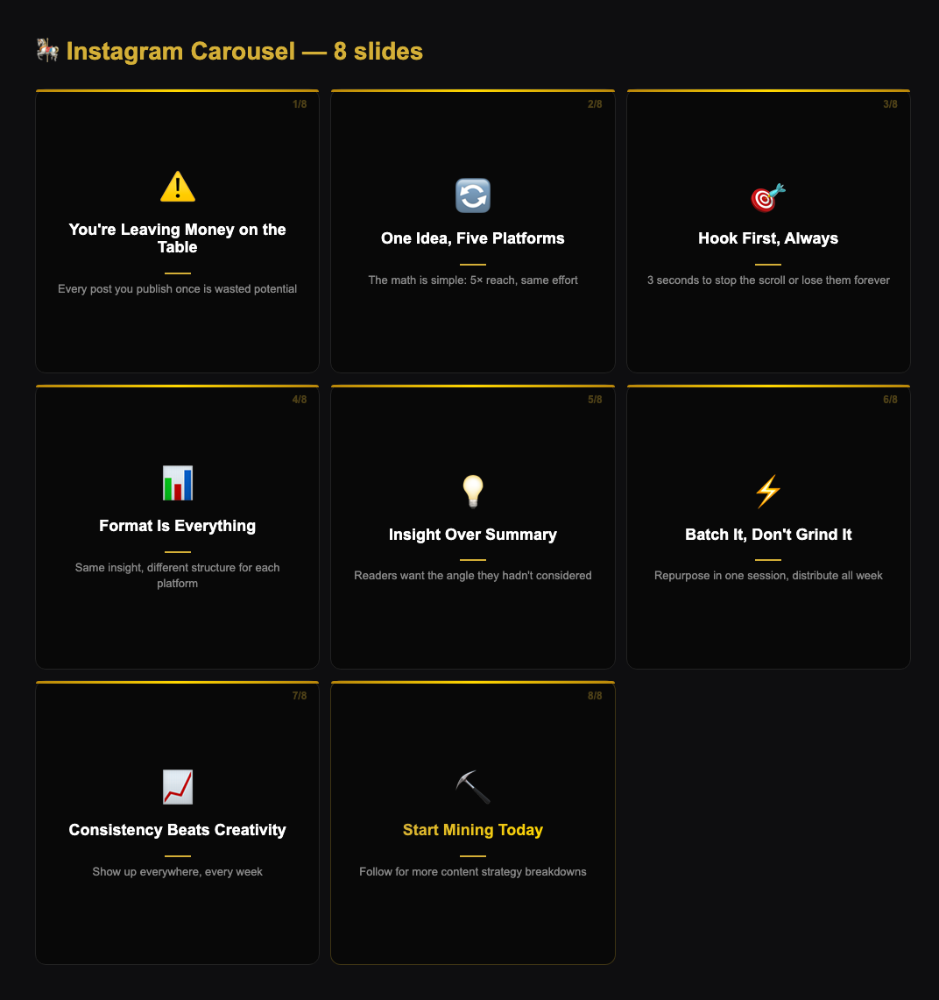
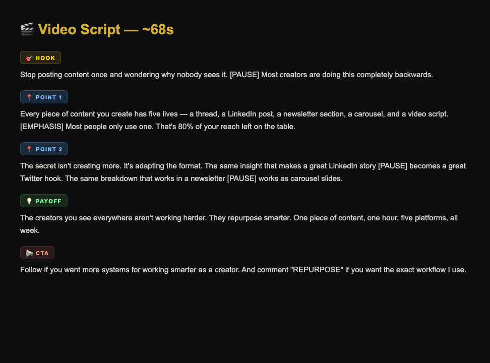

<div align="center">

# ⛏️ ContentGoldMine

### The content repurposing machine built for creators who want to work smarter.

**One blog post. One YouTube video. One idea.**
**→ Instantly becomes a viral thread, LinkedIn post, newsletter, carousel, and video script.**

[](https://python.org)
[](https://github.com/mohitagw15856/ContentGoldMine/stargazers)
[](https://github.com/mohitagw15856/ContentGoldMine/network)
[](LICENSE)
[](https://github.com/harry0703/MoneyPrinterTurbo)

</div>

---

## The Problem Every Creator Knows

You spend hours researching and writing a great piece of content.

You publish it once. It gets a handful of views. Then it's gone.

Meanwhile, the creators making real money from content aren't writing more — **they're repurposing smarter**. The same insight that makes a great LinkedIn post also makes a great Twitter thread, a newsletter section, an Instagram carousel, and a TikTok script.

**ContentGoldMine automates that entire process.**

---

## See It In Action

### The App


### Batch Mode — Process Multiple URLs At Once


### 𝕏 Thread Output — Tweet Cards with Live Character Counts


### 🎠 Carousel Slides — 1080×1080 Generated Images


### 🎬 Video Script — Color-Coded Sections


---

## What You Get

Paste any URL or text → click **Mine the Gold** → get back 5 ready-to-post formats:

| Format | What's Generated | Best For |
|--------|-----------------|---------|
| **𝕏 Thread** | 10–14 tweets with hooks, live char count | Growing X / Twitter |
| **💼 LinkedIn Post** | Story-driven post with takeaways + hashtags | B2B authority & leads |
| **📧 Newsletter** | Subject line, preview text, formatted body | Email monetization |
| **🎠 Instagram Carousel** | 8–10 designed 1080×1080 PNG slides | Saves & shares |
| **🎬 Video Script** | Hook + 3 points + payoff + CTA | TikTok / Reels / Shorts |

---

## Who Is This For?

- **Content creators** who publish on one platform and watch everything else go dark
- **Solopreneurs** who want to be everywhere without burning out
- **Newsletter writers** who want to squeeze social reach from every issue
- **YouTubers** who want to milk every video for 5× the reach
- **Marketers** who need quality content at scale — not just volume

---

## Features

- **3 Input Types** — Blog/article URL, YouTube URL, or raw text
- **5 Platform Outputs** — Thread, LinkedIn, Newsletter, Carousel, Video Script
- **📦 Batch Mode** — Drop in 10 URLs, get 50 pieces of content
- **🎠 Beautiful Carousel Images** — Real 1080×1080 PNGs rendered via Playwright (not clip art)
- **🔐 Saved API Keys** — Type once, use forever (stored locally, never sent anywhere)
- **⚡ Live Progress** — Watch each format generate in real time
- **🌍 Multi-language** — English, Spanish, French, German, Portuguese, Hindi, Arabic
- **3 LLM Providers** — OpenAI, Anthropic (Claude), Google Gemini
- **3 Carousel Themes** — Gold, Dark, Light
- **REST API** — Full FastAPI backend for automation
- **CLI** — Run from the terminal for scripting

---

## Quick Start

### 1. Clone & install

```bash
git clone https://github.com/mohitagw15856/ContentGoldMine.git
cd ContentGoldMine
python -m venv .venv && source .venv/bin/activate   # Windows: .venv\Scripts\activate
pip install -r requirements.txt
playwright install chromium
```

### 2. Launch

```bash
python main.py webui
# Opens at http://localhost:8501
```

### 3. Use it

1. Paste your API key in the sidebar → hit **💾** to save it permanently
2. Drop in a URL (blog, YouTube, or anything)
3. Pick your platforms
4. Click **⛏️ Mine the Gold**

That's it. Your 5 formats will be ready in under 60 seconds.

---

## Batch Processing

Turn a week's worth of reading into a week's worth of content in one click.

Enable **Batch Mode** → paste your URLs (one per line) → hit Mine.

ContentGoldMine processes each URL sequentially with live progress and outputs all formats grouped by source.

```
https://medium.com/article-1
https://youtube.com/watch?v=abc123
https://yourfavoriteblog.com/post
```

→ 3 URLs × 5 formats = **15 pieces of content**, automatically.

---

## API Usage

```bash
python main.py api
# Docs at http://localhost:8000/docs
```

```bash
curl -X POST http://localhost:8000/repurpose \
  -H "Content-Type: application/json" \
  -d '{
    "input_type": "url",
    "value": "https://yourblog.com/post",
    "platforms": ["x_thread", "linkedin", "carousel"],
    "llm_provider": "openai",
    "api_key": "sk-...",
    "language": "English"
  }'
```

---

## CLI

```bash
# Repurpose a blog post (all platforms)
python main.py repurpose url "https://yourblog.com/post" --key sk-...

# YouTube video, specific platforms, Spanish output
python main.py repurpose youtube "https://youtube.com/watch?v=..." \
  --key sk-... --platforms "x_thread,linkedin" --lang Spanish
```

---

## Supported LLM Providers

| Provider | Recommended Model | Get API Key |
|----------|------------------|-------------|
| **OpenAI** | `gpt-4o` | [platform.openai.com](https://platform.openai.com/api-keys) |
| **Anthropic** | `claude-sonnet-4-6` | [console.anthropic.com](https://console.anthropic.com) |
| **Google Gemini** | `gemini-1.5-pro` | [aistudio.google.com](https://aistudio.google.com/apikey) |

---

## Project Structure

```
ContentGoldMine/
├── main.py                     # CLI entry (webui / api / repurpose)
├── app/
│   ├── webui.py                # Streamlit UI
│   └── api.py                  # FastAPI REST API
├── goldmine/
│   ├── engine.py               # Orchestrator
│   ├── key_store.py            # Local API key persistence
│   ├── ingestor/               # URL / YouTube / Text extractors
│   ├── llm/                    # OpenAI, Anthropic, Gemini providers
│   ├── transformer/            # Per-platform content transformers
│   └── renderer/               # HTML→PNG carousel renderer (Playwright)
└── assets/carousel_output/     # Generated carousel images
```

---

## Roadmap

- [x] Blog URL + YouTube + raw text ingestion
- [x] X Thread, LinkedIn, Newsletter, Carousel, Video Script
- [x] Beautiful HTML+Playwright carousel image generation
- [x] Saved API keys (local, private)
- [x] Live generation progress
- [x] **Batch processing** (multiple URLs at once)
- [x] Multi-language support
- [x] FastAPI backend + CLI
- [ ] Auto-post to X, LinkedIn, Instagram
- [ ] Podcast/audio input (Whisper transcription)
- [ ] Custom brand voice settings
- [ ] Scheduled repurposing (weekly automation)
- [ ] Analytics — track what performs best

---

## Contributing

PRs welcome. Open an issue first for anything major.

---

## License

MIT — use it, fork it, build on it, make money with it.

---

<div align="center">

**If ContentGoldMine saved you time, drop it a ⭐ — it helps other creators find it.**

Built for creators who want to work 10× smarter, not harder.

</div>
